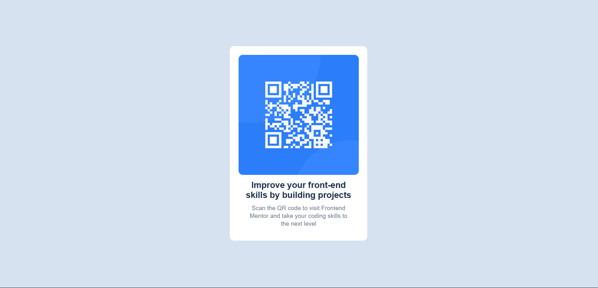

# Frontend Mentor - QR code component solution

This is a solution to the [QR code component challenge on Frontend Mentor](https://www.frontendmentor.io/challenges/qr-code-component-iux_sIO_H). Frontend Mentor challenges help you improve your coding skills by building realistic projects. 

## Table of contents

- [Overview](#overview)
  - [Screenshot](#screenshot)
  - [Links](#links)
- [My process](#my-process)
  - [Built with](#built-with)
  - [What I learned](#what-i-learned)
  - [Continued development](#continued-development)
  - [Useful resources](#useful-resources)
- [Author](#author)
- [Acknowledgments](#acknowledgments)


## Overview

### Screenshot




### Links

- Solution URL: [Add solution URL here](https://your-solution-url.com)
- Live Site URL: [Add live site URL here](https://your-live-site-url.com)

## My process

### Built with

- Semantic HTML5 markup
- CSS custom properties
- Flexbox
- CSS Grid
- Mobile-first workflow
- [React](https://reactjs.org/) - JS library
- [Next.js](https://nextjs.org/) - React framework
- [Styled Components](https://styled-components.com/) - For styles

**Note: These are just examples. Delete this note and replace the list above with your own choices**

### What I learned

I have learned html semantic tags and also how to use classes in html and selectors

```html
<!DOCTYPE html>
<html lang="en">
<head>
  <meta charset="UTF-8">
  <meta name="viewport" content="width=device-width, initial-scale=1.0"> <!-- displays site properly based on user's device -->

  <link rel="icon" type="image/png" sizes="32x32" href="./images/favicon-32x32.png">
  <link rel="stylesheet" href="styles.css">
  <link rel="preconnect" href="https://fonts.googleapis.com">
  <link rel="preconnect" href="https://fonts.gstatic.com" crossorigin>
  <link
    href="https://fonts.googleapis.com/css2?family=Dancing+Script:wght@400..700&family=Outfit:wght@100..900&display=swap"
    rel="stylesheet">
  <title>Frontend Mentor | QR code component</title>
</head>
<body>

  <div class="qr-code-card">
    
    <div class="qr-code-content">
      <h3>Improve your front-end skills by building projects</h3>
      <p>Scan the QR code to visit Frontend Mentor and take your coding skills to the next level</p>
    </div>
</div>
  
  
  
  
  
  
  

  
  <div class="attribution">
    Challenge by <a href="https://www.frontendmentor.io?ref=challenge" target="_blank">Frontend Mentor</a>. 
    Coded by <a href="#">Olivier</a>.
  </div>
</body>
</html>
```
```css

:root{
--White: hsl(0, 0%, 100%);
--Slate-300: hsl(212, 45%, 89%);
--Slate-500: hsl(216, 15%, 48%);
--Slate-900: hsl(218, 44%, 22%);
}


*{
    margin: 0;
    padding: 0;
    box-sizing: border-box;
   font-family: "Outfit", sans-serif;
   
}
html{
    font-size: 62.5%;
}
img{
    width: 100%;
}
body{
    min-height: 100vh;
    display: flex;
    width: 100%;
    align-items: center;
    justify-content: center;
    background-color: var(--Slate-300);

}
.qr-code-card{
  width: 320px;  
  padding: 20px;
  background-color: var(--White);
  border-radius: 10px;
  cursor: pointer;
}
.qr-code-img{
    margin-bottom: 10px;
  border-radius: 10px;

}
.qr-code-content{
    padding: 0px 15px;
}
.qr-code-content h3{
    font-size: 20px;
    margin-bottom: 10px;
    text-align: center;
    color: var(--Slate-900);
    font-weight: 700;

}
.qr-code-content p{
    font-size: 14px;
    text-align: center;
    margin-bottom: 10px;
    line-height: 1.3;
    color: var(--Slate-500);
    font-weight: 400;

}

 .attribution { font-size: 11px; text-align: center; 
    display: none;}
    .attribution a { color: hsl(228, 45%, 44%);
     }
```
```js
No  js yet
```

### Continued development

I am curious about completing more projects for better experience and learn JS and other related frameworks.

### Useful resources


- [Resource](https://www.freecodecamp.org/learn/2022/responsive-web-design/) - This is an amazing article which helped me finally understand semantic tags and media queries for responsive design. I'd recommend it to anyone still learning Responsive Design.
## Author

- Website - [Add your name here](https://www.your-site.com)
- Frontend Mentor - [@Olivier@123](https://www.frontendmentor.io/profile/Olivier2-prog)


## Acknowledgments

I would like to thank Frontend mentor for endless challenges and also freecodecamp for their course

